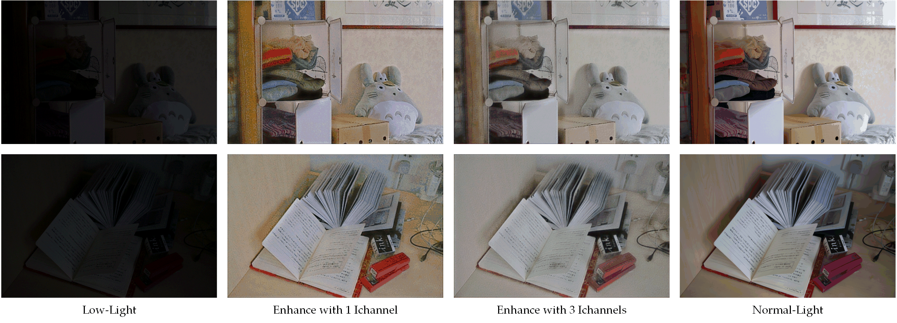

# Retinex_PyTorch

This is a unofficial Pytorch implementation of RetinexNet for low light enhancement.

## paper

[Deep Retinex Decomposition for Low-Light Enhancement](https://arxiv.org/pdf/1808.04560), in  In BMVC 2018.

## Results



## train & test

### train
```
# illumination channel number = 1
python train.py --Ichannel 1 --checkpoint_dir ./checkpoint_1 --ngpus 2
# illumination channel number = 3
python train.py --Ichannel 3 --checkpoint_dir ./checkpoint_3 --ngpus 2
```
###  test
```
# illumination channel number = 1
python test.py --Ichannel 1 --decomnet_path ./checkpoint_1/decom_final.pth --relightnet_path ./checkpoint_1/relight_final.pth --save_path outimg_1
# illumination channel number = 3
python test.py --Ichannel 3 --decomnet_path ./checkpoint_3/decom_final.pth --relightnet_path ./checkpoint_3/relight_final.pth --save_path outimg_3
```

## Citation

```
@inproceedings{DBLP:conf/bmvc/WeiWY018,
  author    = {Chen Wei and
               Wenjing Wang and
               Wenhan Yang and
               Jiaying Liu},
  title     = {Deep Retinex Decomposition for Low-Light Enhancement},
  booktitle = {British Machine Vision Conference 2018, {BMVC} 2018, Northumbria University,
               Newcastle, UK, September 3-6, 2018},
  pages     = {155},
  publisher = {{BMVA} Press},
  year      = {2018},
  url       = {http://bmvc2018.org/contents/papers/0451.pdf},
  timestamp = {Thu, 12 Mar 2020 11:35:24 +0100},
  biburl    = {https://dblp.org/rec/conf/bmvc/WeiWY018.bib},
  bibsource = {dblp computer science bibliography, https://dblp.org}
}
```